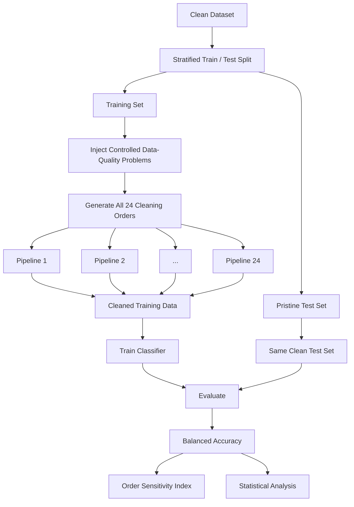
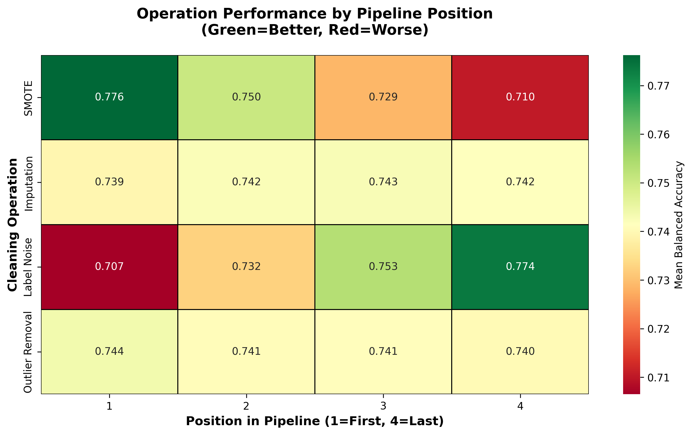
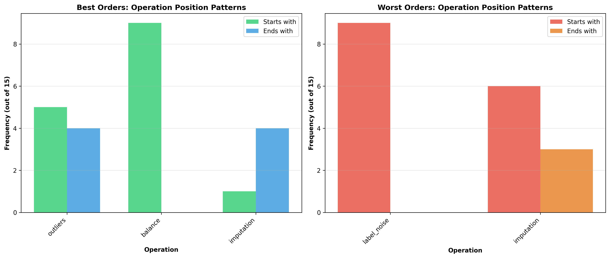

<div align="center">

# Data Cleaning Order Sensitivity

### Quantifying how preprocessing order changes downstream machine-learning performance

[](https://www.python.org/)
[](https://scikit-learn.org/)
[](https://xgboost.ai/)
[](#why-this-matters)
[](#reproducibility)
[](https://doi.org/10.5281/zenodo.20678671)

**Data Quality · Pipeline Design · Data Preprocessing · Reproducible ML · Experimentation · Python**

</div>

---

## Overview

Data-cleaning pipelines are usually built as a sequence of reasonable operations:

```text
Missing-value handling
        ↓
Outlier removal
        ↓
Class balancing
        ↓
Label-noise correction
        ↓
Model training
```

But there is a question that is rarely tested explicitly:

> **Does changing the order of these operations change the final result?**

This project investigates that question systematically.

Four common data-cleaning operations are applied in **every possible order**, producing:

```text
4! = 24 unique preprocessing pipelines
```

Each ordering is evaluated under the same controlled experimental conditions across multiple datasets, random seeds, and classifier families.

The goal is not simply to identify one high-performing pipeline.

The goal is to measure **how sensitive a machine-learning workflow is to preprocessing order itself**.

To quantify that effect, the project introduces the **Order Sensitivity Index (OSI)**.

---

# Why this matters

A preprocessing pipeline is not just a list of independent transformations.

Each operation changes the data received by every operation that comes after it.

For example:

```text
Pipeline A

Imputation
    ↓
Outlier Removal
    ↓
SMOTE
    ↓
Label-Noise Correction
```

and

```text
Pipeline B

SMOTE
    ↓
Label-Noise Correction
    ↓
Imputation
    ↓
Outlier Removal
```

contain exactly the same four operations.

But they can produce different training datasets.

Why?

Because operations interact.

- SMOTE depends on the current minority-class neighbourhood.
- Outlier detection depends on the feature distribution at the point it is applied.
- Label-noise correction depends on the quality of the data used to estimate class probabilities.
- Imputation changes distances and feature relationships used by later transformations.

That makes preprocessing order a potential **hidden source of variation** in machine-learning pipelines.

If two experiments use the same model but different preprocessing sequences, some of the performance difference may come from the pipeline rather than the model itself.

---

# Project at a glance

| Component | Scale |
|---|---:|
| Data-cleaning operations | **4** |
| Possible operation orders | **24** |
| Main datasets | **7** |
| Classifier families | **3** |
| Random seeds | **5** |
| Controlled evaluations | **2,520** |
| Primary metric | **Balanced Accuracy** |
| Proposed diagnostic | **Order Sensitivity Index (OSI)** |

The experiment was designed so that **pipeline order is the main variable being changed**.

---

# Cleaning operations

The study evaluates four common preprocessing operations.

| Operation | Method used |
|---|---|
| **Missing-value imputation** | KNN imputation |
| **Outlier handling** | Isolation Forest |
| **Class balancing** | SMOTE |
| **Label-noise correction** | confidence-based / Confident Learning approach |

Every possible permutation of these four operations is evaluated.

For example:

```text
IMP → OUT → BAL → LNR
IMP → BAL → OUT → LNR
LNR → IMP → BAL → OUT
BAL → LNR → IMP → OUT
...
```

until all **24 possible sequences** have been tested.

---

# Experimental workflow



A central design principle is that the **test set remains untouched**.

Within each random seed:

1. the clean dataset is split into training and test data,
2. the test set is kept pristine,
3. controlled faults are introduced only into the training data,
4. every preprocessing order operates on the same experimental starting point,
5. every resulting model is evaluated on the same clean test set.

This reduces the risk that differences between pipeline orders are actually caused by different test distributions.

---

# Controlled data-quality problems

The training data is deliberately degraded before cleaning.

The experimental setup includes controlled problems such as:

### Missing values

Missingness is introduced under a Missing At Random setting.

```text
Clean training data
        ↓
Controlled missingness
        ↓
Imputation at different pipeline positions
```

---

### Outliers

Extreme feature values are injected to represent measurement or data-quality errors.

```text
Normal observations
        ↓
Injected extreme values
        ↓
Isolation Forest applied at different stages
```

---

### Label noise

A portion of training labels is deliberately corrupted.

The injected noise is class-dependent, with minority-class examples receiving a greater share of the corruption.

This allows the experiment to study the interaction between:

```text
Label Noise Correction
        ↕
Class Rebalancing
```

---

### Class imbalance

The datasets include both balanced and imbalanced classification problems.

SMOTE is used as the class-balancing operation, allowing the experiment to measure whether its position inside the pipeline changes downstream performance.

---

# The Order Sensitivity Index

Absolute performance gaps are difficult to compare between datasets because datasets have different baseline difficulty.

To make order sensitivity comparable, the project introduces the **Order Sensitivity Index (OSI)**.

For dataset \(D\):

```text
      Best Performance − Worst Performance
OSI = ------------------------------------
             Best Performance
```

or formally:

```text
OSI(D) =
max P(D, π) − min P(D, π)
-------------------------
       max P(D, π)
```

where:

```text
π = a preprocessing ordering
P = balanced accuracy
```

---

## Interpretation

### OSI ≈ 0

The dataset is relatively insensitive to preprocessing order.

Different sequences produce similar performance.

### Higher OSI

The pipeline is more sensitive to sequencing.

Choosing a poor order can result in measurable performance loss even when:

- the same data is used,
- the same operations are used,
- the same classifier is used,
- and the same hyperparameters are used.

---

# Datasets

The main study evaluates seven publicly available binary-classification datasets.

| Dataset | Samples | Features | Class profile |
|---|---:|---:|---|
| **PIMA Diabetes** | 767 | 8 | Imbalanced |
| **Adult Income** | 30,162 | 14 | Imbalanced |
| **Credit Default** | 30,000 | 23 | Imbalanced |
| **Breast Cancer Wisconsin** | 569 | 30 | Relatively balanced |
| **Spambase** | 4,601 | 57 | Relatively balanced |
| **Ionosphere** | 351 | 34 | Relatively balanced |
| **Banknote Authentication** | 1,372 | 4 | Relatively balanced |

The datasets provide variation in:

- sample size,
- feature dimensionality,
- application domain,
- minority-class size,
- and class imbalance.

An additional MAGIC Gamma Telescope experiment was also conducted as a supplementary analysis, but the main conclusions are based on the seven datasets above.

---

# Models

The complete preprocessing-order experiment is evaluated using three classifier families.

### Random Forest

A non-linear ensemble model that can be sensitive to changes in the composition of the training data.

### Logistic Regression

A linear baseline with a substantially different learning mechanism.

### XGBoost

A gradient-boosted tree model used to test whether ordering effects persist under another ensemble-learning approach.

The study intentionally uses fixed hyperparameters during the controlled comparisons.

The purpose is not to obtain the highest possible predictive performance.

The purpose is to isolate the effect of **pipeline order**.

---

# Experiment scale

For each classifier:

```text
7 datasets
×
24 preprocessing orders
×
5 random seeds
=
840 controlled runs
```

Across three classifiers:

```text
840 × 3 = 2,520 evaluations
```

For every seed, all preprocessing orders share the same underlying train/test partition.

This creates a controlled within-seed comparison.

---

# Main findings

The experiments show that preprocessing order is not always a neutral implementation decision.

Under Random Forest, OSI values ranged from:

```text
1.40% → 8.39%
```

The largest observed difference between the best and worst preprocessing sequences reached:

```text
6.19 percentage points
```

in balanced accuracy.

---

## Random Forest results

| Dataset | OSI | Best accuracy | Worst accuracy | Gap |
|---|---:|---:|---:|---:|
| **PIMA** | **8.39%** | 0.7377 | 0.6758 | **6.19 pp** |
| **Credit Default** | **8.28%** | 0.5994 | 0.5498 | **4.96 pp** |
| Adult Income | 3.02% | 0.7202 | 0.6985 | 2.17 pp |
| Ionosphere | 3.17% | 0.9011 | 0.8725 | 2.86 pp |
| Breast Cancer | 2.05% | 0.9375 | 0.9183 | 1.92 pp |
| Spambase | 1.85% | 0.9130 | 0.8961 | 1.69 pp |
| Banknote | 1.40% | 0.9816 | 0.9679 | 1.38 pp |

Five of the seven datasets showed statistically significant best-versus-worst ordering differences under Random Forest after multiple-comparison correction.

---

# Class imbalance and order sensitivity

One of the clearest patterns appeared under Random Forest.

Mean OSI for the three imbalanced datasets:

```text
6.56%
```

Mean OSI for the four relatively balanced datasets:

```text
2.12%
```

That corresponds to roughly:

```text
3.1× higher order sensitivity
```

for the imbalanced group under Random Forest.

---

## Classifier comparison

| Dataset | Random Forest OSI | Logistic Regression OSI | XGBoost OSI |
|---|---:|---:|---:|
| PIMA | 8.39% | 5.04% | 7.07% |
| Adult | 3.02% | 2.26% | 4.60% |
| Credit Default | 8.28% | 2.61% | 0.94% |
| Breast Cancer | 2.05% | 3.92% | 3.71% |
| Spambase | 1.85% | 2.02% | 3.40% |
| Ionosphere | 3.17% | 5.71% | 7.67% |
| Banknote | 1.40% | 1.20% | 2.09% |

The strongest imbalance-related amplification appeared for Random Forest.

The same 3.1× pattern was not observed for Logistic Regression or XGBoost under the evaluated conditions.

---

# The strongest interaction: label noise and SMOTE

The most important pairwise interaction in the study involved:

```text
Label-Noise Correction
          ↕
        SMOTE
```

Why does the order matter?

SMOTE creates synthetic minority-class observations using existing minority-class examples.

If incorrectly labelled minority examples are still present when SMOTE runs, those examples can influence the synthetic population.

Conceptually:

```text
Noisy minority observations
          ↓
SMOTE
          ↓
Synthetic observations derived
from an already corrupted pool
```

However, reversing the order is not automatically better in every dataset.

For small minority classes, performing label-noise correction too early may provide too little data for reliable probability estimation.

The experiments therefore do **not** support one universal sequence that is optimal everywhere.

Instead, the results show that:

> **The usefulness of a preprocessing order depends on the dataset and on interactions between the transformations.**

---

# Operation-position analysis

The repository also analyses whether individual operations systematically perform better when placed earlier or later in the pipeline.



Across all datasets and classifiers, simple global position effects are relatively weak.

This is important because it suggests that the problem cannot be reduced to a rule such as:

```text
"Always put operation X first."
```

Interactions between operations are more informative than isolated positions.

---

# Best and worst order patterns

The repository also compares positional patterns found in stronger and weaker pipeline configurations.



One notable pattern was that class balancing frequently appeared late in poor-performing configurations.

However, these findings are interpreted as patterns observed under the evaluated experimental settings rather than universal preprocessing rules.

---

# Practical fixed-order comparison

A commonly reasonable sequence was also evaluated:

```text
Imputation
    ↓
Outlier Removal
    ↓
Class Balancing
    ↓
Label-Noise Correction
```

Under Random Forest, this fixed ordering was sometimes close to the best-performing pipeline and sometimes substantially worse.

| Dataset | Best of 24 | Fixed order | Gap |
|---|---:|---:|---:|
| PIMA | 0.7377 | 0.7304 | 0.73 pp |
| Adult | 0.7202 | 0.6985 | 2.17 pp |
| Credit Default | 0.5994 | 0.5501 | **4.93 pp** |
| Breast Cancer | 0.9375 | 0.9264 | 1.11 pp |
| Spambase | 0.9130 | 0.9066 | 0.64 pp |
| Ionosphere | 0.9011 | 0.8830 | 1.81 pp |
| Banknote | 0.9816 | 0.9712 | 1.05 pp |

Mean gap:

```text
1.78 percentage points
```

This illustrates why a conventional default preprocessing order should not automatically be assumed to be optimal.

---

# Statistical analysis

The project uses several complementary statistical tools.

### Balanced Accuracy

Used as the primary predictive-performance metric because it weights both classes equally and is therefore more informative than standard accuracy on imbalanced datasets.

---

### Paired comparisons

Best and worst pipeline orders are compared within the same random-seed setting.

---

### Benjamini–Hochberg correction

Multiple comparisons across dataset–classifier combinations are controlled using false-discovery-rate correction.

---

### Cliff's Delta

A non-parametric effect-size measure used to quantify separation between best- and worst-order outcomes.

---

### Cohen's d

Also reported, although interpreted cautiously because the controlled paired design can produce very low within-seed variance.

---

### Bootstrap confidence intervals

Bootstrap intervals are used as an additional estimate of uncertainty around order-sensitivity measurements.

---

### Spearman correlation

The relationship between class imbalance and OSI is also investigated.

Under Random Forest, the seven-dataset analysis reports:

```text
rs = 0.82
p = 0.023
```

indicating a positive relationship between imbalance ratio and order sensitivity under the evaluated setting.

---

# Why this project is relevant to Data Engineering

Although the study evaluates downstream machine-learning performance, the underlying problem is strongly connected to **data pipeline engineering**.

A transformation pipeline is an ordered system.

```text
Raw Data
   ↓
Transformation A
   ↓
Transformation B
   ↓
Transformation C
   ↓
Downstream Consumer
```

Changing the ordering can change the final dataset even when every individual step is valid.

That has implications for several engineering areas.

---

## Data quality

This project treats data cleaning as a system of interacting transformations rather than a collection of independent fixes.

It evaluates how:

- missing-data handling,
- outlier removal,
- resampling,
- and label-quality correction

change the state of the data passed downstream.

---

## Pipeline design

The project demonstrates that transformation order itself can be part of pipeline logic.

A reproducible pipeline should therefore capture:

```text
What transformation ran?
        +
With what configuration?
        +
On which data?
        +
In what order?
```

---

## Pipeline testing

Controlled faults are deliberately injected into the data so that pipeline behaviour can be evaluated under known degradation.

This is conceptually similar to fault injection and mutation testing in software engineering.

Instead of asking only:

> "Does the pipeline run?"

the project asks:

> "How does the pipeline behave when the input contains specific data-quality problems?"

---

## Reproducibility

Experiment configuration is controlled through:

- fixed random seeds,
- consistent train/test separation,
- repeated evaluation,
- stored result tables,
- dedicated statistical-analysis scripts,
- reproducibility tooling,
- and a permanent Zenodo archive.

---

## ML Engineering / MLOps

The work also demonstrates an important MLOps principle:

> Model behaviour is affected by the data pipeline that precedes the model.

Reproducing only the trained model is not enough if the preprocessing sequence is different.

Pipeline configuration is part of the experiment.

---

# Repository architecture

```text
data-cleaning-order-sensitivity/
│
├── src/
│   │
│   ├── cleaning/
│   │   └── methods.py
│   │       └── Cleaning operations and sequencing logic
│   │
│   ├── data/
│   │   ├── loaders.py
│   │   └── Dataset loading and preparation
│   │
│   ├── faults/
│   │   └── injection.py
│   │       └── Controlled data-quality fault injection
│   │
│   ├── metrics/
│   │   ├── evaluation_protocol.py
│   │   ├── osi.py
│   │   ├── statistics.py
│   │   └── Performance and statistical evaluation
│   │
│   ├── models/
│   │   └── Model-related utilities
│   │
│   └── utils/
│       └── Shared experiment utilities
│
├── experiments/
│   └── publication_runner.py
│       └── Controlled permutation experiment runner
│
├── data/
│   └── raw/
│       └── Raw benchmark datasets
│
├── results/
│   ├── figures/
│   │   ├── operation_position_heatmap.png
│   │   └── order_pattern_analysis.png
│   │
│   ├── tables/
│   │   └── Experimental and statistical outputs
│   │
│   ├── METHODOLOGY_SECTION.txt
│   └── THREATS_TO_VALIDITY.txt
│
├── analyze_5_datasets.py
├── analyze_minority_class_impact.py
├── analyze_operation_positions.py
├── analyze_order_patterns.py
├── compute_cliffs_delta.py
├── compute_enhanced_statistics.py
├── create_publication_tables.py
├── generate_methodology_text.py
├── reproduce_all.py
├── requirements.txt
└── README.md
```

---

# Code organisation

The repository deliberately separates different concerns.

### `src/data`

Responsible for:

- loading datasets,
- preparing feature matrices,
- encoding categorical variables,
- and exposing consistent dataset interfaces.

---

### `src/faults`

Implements controlled data-quality degradation such as:

- label corruption,
- missing-value injection,
- class-distribution manipulation,
- and synthetic outliers.

---

### `src/cleaning`

Contains the preprocessing operations evaluated in the experiment.

Examples include:

- KNN-based missing-value imputation,
- Isolation Forest,
- SMOTE,
- confidence-based label-noise handling.

---

### `src/metrics`

Contains evaluation logic including:

- balanced accuracy,
- OSI computation,
- controlled evaluation protocol,
- and statistical analysis.

---

### `experiments`

Contains the experiment runner responsible for generating all preprocessing permutations and evaluating them under fixed experimental conditions.

---

### `results`

Stores:

- statistical tables,
- analysis outputs,
- figures,
- methodology artifacts,
- and reproducibility results.

---

# Quick start

## 1. Clone the repository

```bash
git clone https://github.com/idrees118/data-cleaning-order-sensitivity.git
cd data-cleaning-order-sensitivity
```

---

## 2. Create a virtual environment

### macOS / Linux

```bash
python -m venv .venv
source .venv/bin/activate
```

### Windows

```powershell
python -m venv .venv
.venv\Scripts\activate
```

---

## 3. Install dependencies

```bash
pip install -r requirements.txt
```

Core packages include:

```text
NumPy
pandas
scikit-learn
XGBoost
imbalanced-learn
SciPy
statsmodels
Matplotlib
Seaborn
PyYAML
tqdm
```

---

# Running analysis

The repository contains dedicated scripts for different parts of the study.

### Cross-dataset analysis

```bash
python analyze_5_datasets.py
```

---

### Minority-class analysis

```bash
python analyze_minority_class_impact.py
```

---

### Operation-position analysis

```bash
python analyze_operation_positions.py
```

---

### Best/worst order pattern analysis

```bash
python analyze_order_patterns.py
```

---

### Cliff's delta

```bash
python compute_cliffs_delta.py
```

---

### Extended statistical analysis

```bash
python compute_enhanced_statistics.py
```

---

### Publication tables

```bash
python create_publication_tables.py
```

---

# Reproducibility

The study uses five fixed random seeds:

```python
[42, 43, 44, 45, 46]
```

Each seed creates its own stratified train/test partition.

Within that seed:

- the test set remains clean,
- all 24 pipeline orders use the same experimental split,
- the same controlled degradation is used for the within-seed comparison,
- and model settings remain fixed.

This allows pipeline-order effects to be compared under controlled conditions.

---

## Reproducibility helper

The repository includes:

```bash
python reproduce_all.py
```

This script is designed to:

- verify the Python environment,
- inspect available experiment outputs,
- run statistical validation,
- regenerate publication tables,
- regenerate methodology artifacts,
- and check expected result files.

The frozen experimental outputs and supporting data are also preserved in the Zenodo archive.

For long-term research reproducibility, the Zenodo record should be treated as the permanent archived snapshot.

---

# Output artifacts

Analysis outputs are stored primarily under:

```text
results/
```

with:

```text
results/
├── figures/
├── tables/
├── METHODOLOGY_SECTION.txt
└── THREATS_TO_VALIDITY.txt
```

This separates generated research artifacts from source code.

---

# Tech stack

| Area | Tools |
|---|---|
| Programming | **Python** |
| Data processing | **pandas, NumPy** |
| Machine learning | **scikit-learn, XGBoost** |
| Class balancing | **imbalanced-learn / SMOTE** |
| Missing-data handling | **KNNImputer** |
| Outlier detection | **Isolation Forest** |
| Statistical analysis | **SciPy, statsmodels** |
| Visualisation | **Matplotlib, Seaborn** |
| Experiment design | **exhaustive permutation testing** |
| Reproducibility | **fixed seeds, stored outputs, Zenodo** |
| Data-quality testing | **controlled fault injection** |

---

# Skills demonstrated

From an engineering perspective, this repository demonstrates work across:

### Python engineering

- modular source-code structure
- reusable classes
- experiment orchestration
- configuration-driven workflows
- logging
- error handling
- result persistence

### Data engineering concepts

- data ingestion
- preprocessing pipelines
- transformation sequencing
- data-quality fault simulation
- reproducibility
- pipeline state dependence

### Machine-learning engineering

- train/test isolation
- preprocessing design
- class imbalance
- model evaluation
- multi-model experimentation

### Experimental engineering

- controlled variable isolation
- exhaustive parameter/permutation search
- multi-seed experiments
- reproducible outputs
- statistical validation

### Research software

- methodology implementation
- automated analysis
- publication table generation
- permanent artifact archiving
- reproducibility documentation

---

# Research study

This repository supports the study:

## *The Order Sensitivity Index: Quantifying Preprocessing Pipeline Order Effects in Tabular Machine Learning*

### Authors

**Muhammad Idrees**  
Adnan Amin  
Feras Al-Obeidat  
Kaizhu Huang  
Fernando Moreira  
Amir Hussain

---

# My contribution

My contribution to the project included:

- study methodology development,
- software development,
- implementation of the experimental framework,
- controlled data-quality fault injection,
- preprocessing-pipeline experiments,
- statistical analysis,
- reproducibility workflow development,
- and preparation of the original manuscript.

---

# Research archive

The code and experimental materials supporting the study are permanently archived on Zenodo.

### DOI

https://doi.org/10.5281/zenodo.20678671

The Zenodo archive provides a permanent research snapshot independent of the evolving GitHub repository.

---

# Limitations

The results should be interpreted within the evaluated experimental setting.

The study uses:

- four specific cleaning operations,
- seven main datasets,
- three classifier families,
- five random seeds,
- predefined fault-injection settings,
- and fixed cleaning/model hyperparameters.

Different preprocessing implementations or substantially different data-quality conditions may produce different ordering effects.

The experiment therefore demonstrates that preprocessing order **can be consequential**, rather than claiming that one universal order should be used for every dataset.

---

# Main takeaway

A preprocessing pipeline should not be described only by the operations it contains.

The sequence matters too.

```text
Same dataset
+
Same cleaning methods
+
Same classifier
+
Different transformation order
=
Potentially different result
```

For reproducible data and machine-learning systems, it is therefore useful to record:

```text
WHAT transformations were applied

            +

HOW they were configured

            +

WHEN they were applied
```

Pipeline order is part of the pipeline.

---

<div align="center">

### Data Quality · Pipeline Engineering · Reproducibility · Machine Learning · Python

[GitHub Repository](https://github.com/idrees118/data-cleaning-order-sensitivity)
&nbsp;•&nbsp;
[Zenodo Archive](https://doi.org/10.5281/zenodo.20678671)

</div>
